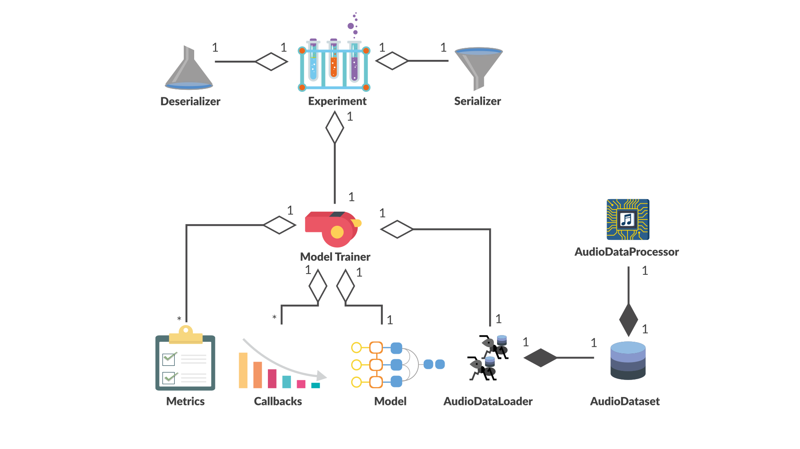

<br>
<br>
<br>
<br>

Sonosco (from Lat. sonus - sound and nōscō - I know, recognize) 
is a library for training and deploying deep speech recognition models.

The goal of this project is to enable fast, repeatable and structured training of deep 
automatic speech recognition (ASR) models as well as providing a transcription server (REST API & frontend) to 
try out the trained models for transcription. <br>
Additionally, we provide interfaces to ROS in order to use it with 
the anthropomimetic robot [Roboy](https://roboy.org/).
<br>
<br>
<br>

___
### Installation

#### Via pip
The easiest way to use Sonosco's functionality is via pip:
```
pip install sonosco
```
**Note**: Sonosco requires Python 3.6 or higher.

For reliability, we recommend using an environment virtualization tool, like virtualenv or conda.

<br>
<br>

#### For developers or trying out the transcription server

Clone the repository and install dependencies:
```
# Clone the repo and cd inside it
git clone https://github.com/Roboy/sonosco.git && cd sonosco

# Create a virtual python environment to not pollute the global setup
python -m venv venv

# Activate the virtual environment
source venv/bin/activate

# Install normal requirements
pip install -r requirements.txt

# Link your local sonosco clone into your virtual environment
pip install -e .
```
Now you can check out some of the [Getting Started]() tutorials, to train a model or use 
the transcription server.
<br>
<br>
<br>
____________
### Quick Start

#### Dockerized inference server

```
cd server

# Build the docker image
./build.sh

# Run the built image
./run.sh
```

Open http://localhost:5000 in Chrome. You should be able to add models for performing
transcription by clicking on the plus button. Once the models are added, record your own
voice by clicking on the record button. You can replay and transcribe with the
corresponding buttons.

____________
### High Level Design


The project is split into 4 parts that correlate with each other:

For data(-processing) scripts are provided to download and preprocess 
some publicly available datasets for speech recognition. Additionally, 
we provide scripts and functions to create manifest files 
(i.e. catalog files) for your own data and merge existing manifest files
into one.

This data or rather the manifest files can then be used to easily train and 
evaluate an ASR model. We provide some ASR model architectures, such as LAS, 
TDS and DeepSpeech2 but also individual pytorch models can be designed to be trained.

The trained model can then be used in a transcription server, that consists 
of a REST API as well as a simple Vue.js frontend to transcribe voice recorded 
by a microphone and compare the transcription results to other models (that can
be downloaded in our [Github](https://github.com/Roboy/sonosco) repository).

Further we provide example code, how to use different ASR models with ROS
and especially the Roboy ROS interfaces (i.e. topics & messages).

<br>
<br>

  
______
### Data (-processing)

##### Downloading publicly available datasets
We provide scripts to download and process the following publicly available datasets:
* [An4](http://www.speech.cs.cmu.edu/databases/an4/) - Alphanumeric database
* [Librispeech](http://www.openslr.org/12) - reading english books
* [TED-LIUM 3](https://lium.univ-lemans.fr/en/ted-lium3/) (ted3) - TED talks
* [Voxforge](http://www.voxforge.org/home/downloads)
* common voice (old version)

Simply run the respective scripts in `sonosco > datasets > download_datasets` with the
output_path flag and it will download and process the dataset. Further, it will create 
a manifest file for the dataset.

For example

```
python an4.py --target-dir temp/data/an4
```
<br>
<br>

##### Creating a manifest from your own data

If you want to create a manifest from your own data, order your files as follows:
```
data_directory    
└───txt
│   │   transcription01.txt
│   │   transcription02.txt
│   
└───wav
    │   audio01.wav
    │   audio02.wav
```
To create a manifest, run the `create_manifest.py` script with the data directory and an outputfile 
to automatically create a manifest file for your data.

For example:
```
python create_manifest.py --data_path path/to/data_directory --output-file temp/data/manifest.csv
```

<br>
<br>

##### Merging manifest files 

In order to merge multiple manifests into one, just specify a folder that contains all manifest 
files to be merged and run the ``` merge_manifest.py```.
This will look for all .csv files and merge the content together in the specified output-file.

For example:
```
python merge_manifest.py --merge-dir path/to/manifests_dir --output-path temp/manifests/merged_manifest.csv
```

<br>
<br>


___
### Model Training

One goal of this framework is to keep training as easy as possible and enable 
keeping track of already conducted experiments. 
<br>
<br>

#### Analysis Object Model

For model training, there are multiple objects that interact with each other.



For Model training, one can define different metrics, that get evaluated during the training
process. These metrics get evaluated at specified steps during an epoch and during
validation.<br>
Sonosco provides different metrics already, such as [Word Error Rate (WER)]() or
 [Character Error Rate (CER)]().  But additional metrics can be created in a similar scheme. 
 See [Metrics](). 
 
Additionally, callbacks can be defined. A Callback is an arbitrary code that can be executed during
training. Sonosco provides for example different Callbacks, such as [Learning Rate Reduction](), 
[ModelSerializationCallback](), [TensorboardCallback](), ... <br>
Custom Callbacks can be defined following the examples. See [Callbacks](). 

Most importantly, a model needs to be defined. The model is basically any torch module. For 
(de-) serialization, this model needs to conform to the [Serialization Guide]().<br>
Sonosco provides already existing model architectures that can be simply imported, such as 
[Listen Attend Spell](), [Time-depth Separable Convolutions]() and [DeepSpeech2]().

We created a specific AudioDataset Class that is based on the pytorch Dataset class. 
This AudioDataset requires an AudioDataProcessor in order to process the specified manifest file.
Further we created a special AudioDataLoader based on pytorch's Dataloader class, that 
takes the AudioDataset and provides the data in batches to the model training.

Metrics, Callbacks, the Model and the AudioDataLoader are then provided to the ModelTrainer.
This ModelTrainer takes care of the training process. See [Getting Starter]().

The ModelTrainer can then be registered to the Experiment, that takes care of provenance.
I.e. when starting the training, all your code is time_stamped and saved in a separate directory, 
so you can always repeat the same experiment. Additionally, the serialized model and modeltrainer,
logs and tensorboard logs are saved in this folder.

Further, a Serializer needs to be provided to the Experiment. This object can serialize any
arbitrary class with its parameters, that can then be deserialized using the Deserializer.<br>
When the ```Èxperiment.stop()``` method is called, the model and the ModelTrainer get serialized, 
so that you can simply continue the training, with all current parameters (such as epoch steps,...)
when deserializing the ModelTrainer and continuing training. 