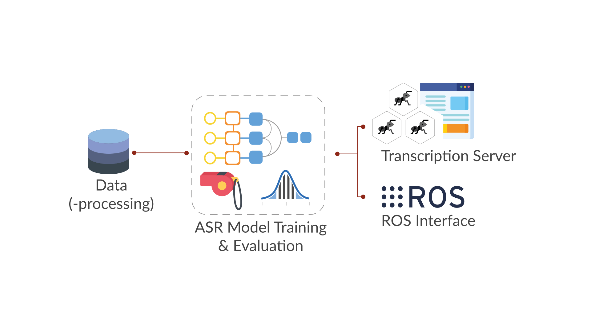

<br>

| **`Documentation`** |
|-----------------|
| [](https://sonosco.readthedocs.io/en/latest/) |

Sonosco (from Lat. sonus - sound and nōscō - I know, recognize) 
is a library for training and deploying deep speech recognition models.

The goal of this project is to enable fast, repeatable and structured training of deep 
automatic speech recognition (ASR) models as well as providing a transcription server (REST API & frontend) to 
try out the trained models for transcription. <br>
Additionally, we provide interfaces to ROS in order to use it with 
the anthropomimetic robot [Roboy](https://roboy.org/).
<br>
<br>
<br>

___
### Installation

#### Via pip
The easiest way to use Sonosco's functionality is via pip:
```
pip install sonosco
```
**Note**: Sonosco requires Python 3.6 or higher.

For reliability, we recommend using an environment virtualization tool, like virtualenv or conda.

<br>
<br>

#### For developers or trying out the transcription server

Clone the repository and install dependencies:
```
# Clone the repo and cd inside it
git clone https://github.com/Roboy/sonosco.git && cd sonosco

# Create a virtual python environment to not pollute the global setup
python -m venv venv

# Activate the virtual environment
source venv/bin/activate

# Install normal requirements
pip install -r requirements.txt

# Link your local sonosco clone into your virtual environment
pip install -e .
```
Now you can check out some of the [Getting Started](#getting_started) tutorials, to train a model or use 
the transcription server.
<br>
<br>
<br>
____________
### Quick Start
<a name="start" class="anchor"></a>
#### Dockerized inference server

Get the hold of our new fully trained models from the latest release! Try out the LAS model for the best performance.
Then specify the folder with the model to the runner script as shown underneath.

You can get the docker image from dockerhub under `yuriyarabskyy/sonosco-inference:1.0`. Just run
`cd server && ./run.sh yuriyarabskyy/sonosco-inference:1.0` to pull and start the server or
optionally build your own image by executing the following commands.

```
cd server

# Build the docker image
./build.sh

# Run the built image
./run.sh sonosco_server
```

You can also specify the path to your own models by writing
`./run.sh <image_name> <path/to/models>`.

Open http://localhost:5000 in Chrome. You should be able to add models for performing
transcription by clicking on the plus button. Once the models are added, record your own
voice by clicking on the record button. You can replay and transcribe with the
corresponding buttons.

You can get pretrained models from the release tab in this repository.
____________
### High Level Design




The project is split into 4 parts that correlate with each other:

For data(-processing) scripts are provided to download and preprocess 
some publicly available datasets for speech recognition. Additionally, 
we provide scripts and functions to create manifest files 
(i.e. catalog files) for your own data and merge existing manifest files
into one.

This data or rather the manifest files can then be used to easily train and 
evaluate an ASR model. We provide some ASR model architectures, such as LAS, 
TDS and DeepSpeech2 but also individual pytorch models can be designed to be trained.

The trained model can then be used in a transcription server, that consists 
of a REST API as well as a simple Vue.js frontend to transcribe voice recorded 
by a microphone and compare the transcription results to other models (that can
be downloaded in our [Github](https://github.com/Roboy/sonosco/releases) repository).

Further we provide example code, how to use different ASR models with ROS
and especially the Roboy ROS interfaces (i.e. topics & messages).

Check our [Documentation](https://sonosco.readthedocs.io/en/latest/index.html) to learn more!
