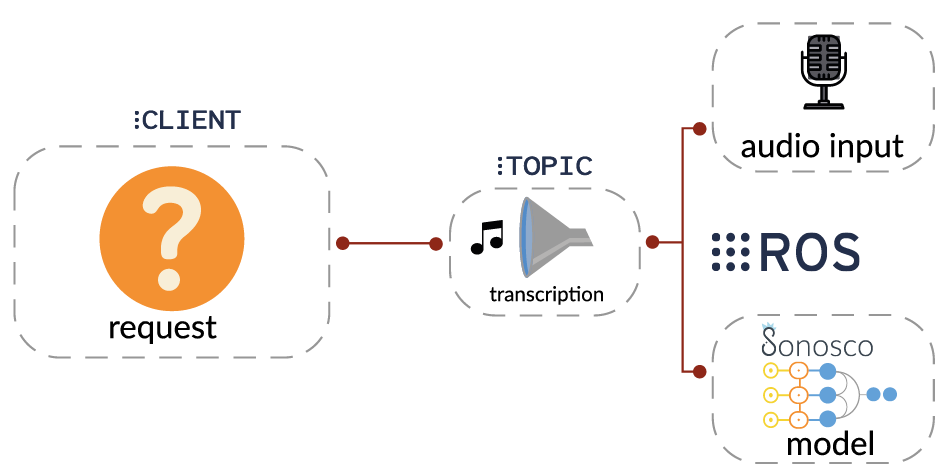

.. _ros_desc:

ROS
====

Sonosco provides convenient access to ROS1 server functionality. To run ROS on your machine:

1. Make sure that ``roscore`` is running
2. Run your server.
   Now all subscribers specified in config will be listening for incoming requests.

::

    with SonoscoROS1(CONFIG) as server:
        server.run()

Example of config:

::

    CONFIG = {
        'node_name': 'roboy_speech_recognition',
        'workers': 5,
        'subscribers': [
            {
                'name': 'recognition',
                'topic': '/roboy/cognition/speech/recognition',
                'service': RecognizeSpeech,
                'callback': custom_callback,

            },
            {
                'name': 'recognition_german',
                'topic': '/roboy/cognition/speech/recognition/german',
                'service': RecognizeSpeech,
            }
        ],
        'publishers': [
            {
                'name': 'ledmode',
                'topic': '/roboy/control/matrix/leds/mode',
                'message': ControlLeds,
                'kwargs': {
                    'queue_size': 3
                }

            },
            {
                'name': 'ledoff',
                'topic': '/roboy/control/matrix/leds/off',
                'message': ControlLeds,
                'kwargs': {
                    'queue_size': 10
                }
            },
            {
                'name': 'ledfreez',
                'topic': '/roboy/control/matrix/leds/freeze',
                'message': ControlLeds,
                'kwargs': {
                    'queue_size': 1
                }
            }
        ],

    }

To ``SonoscoROS1`` you can also pass two additional parameters, namely:

::

        default_asr_interface: SonoscoASR
        default_audio_interface: SonoscoAudioInput

Those will be registered in default callback handling incoming requests:

::

    audio = self.default_audio_interface.request_audio()
    return self.default_asr_interface.infer(audio)

You can also use custom callback per subscriber, in this case you have to handle
the request yourself (the default ASR and audio interfaces are ignored):

::

    def custom_callback(request, publishers):
        msg = ControlLeds()
        msg.mode = 2
        msg.duration = 0
        publishers['ledmode'].publish(msg)
        with MicrophoneClient() as audio_input:
            audio = audio_input.request_audio()
            transcription = asr.infer(audio)
        return transcription

List of publishers specified in config is passed to every callback.

Example of ROS1 server usage can be found `here <https://github.com/Roboy/sonosco/tree/master/ros1_roboy>`_
Take a look at `STT_server.py <https://github.com/Roboy/sonosco/tree/master/ros1_roboy/STT_server.py>`_ and
`STT_client.py <https://github.com/Roboy/sonosco/tree/master/ros1_roboy/STT_client.py>`_