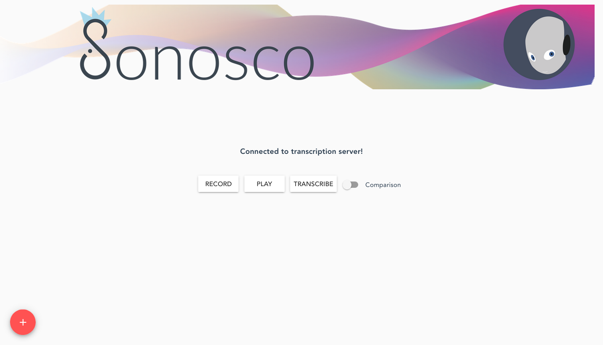
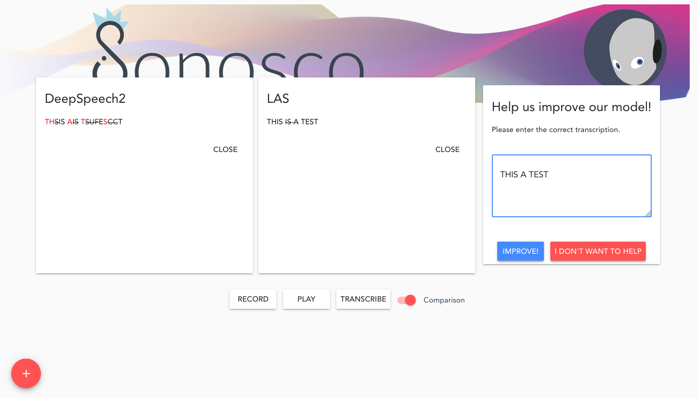

.. _trans_server:

Transcription Server
=====================

In the picture below, you see the GUI we created for our transcription server.
To start this server, follow the [Quick Start](#start).

By pressing on the red plus button, one can add different models, that can be specified in a respective config file. 
Then you can record your voice, by clicking on the 'RECORD' button, listen to it by pressing the 'PLAY' button
and finally transcribing it with 'TRANSCRIBE'.

The transcription of both models is displayed in the respective block. Further,
a popup shows up, where you are asked to correct the transcription. When you click on 'IMPROVE',
the audio and the respective transcription are saves to ``~/.sonosco/audio_data/web_collected/`` .
If one uses the 'Comparison' toggle, the transcriptions are additionally compared to the corrected transcription.

How to use your own model
^^^^^^^^^^^^^^^^^^^^^^^^^^

In order to use your own model with the model trainer, additionally to the serialization guide, you need to implement an inference snippet.
For this, simply follow the `example <https://github.com/Roboy/sonosco/tree/master/sonosco/inference>`_ of the other models.
And then specify your model in the ``../sonosco/server/model_loader.py`` script. (Have a look at the `repo <https://github.com/Roboy/sonosco/blob/master/server/model_loader.py>`_ )
